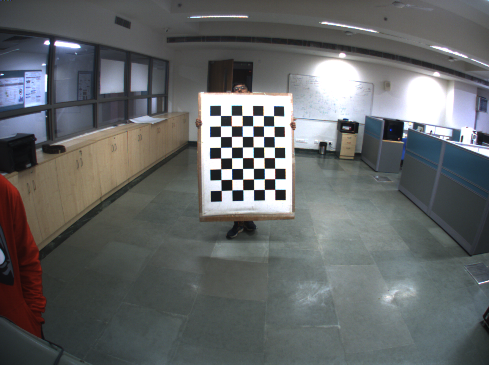
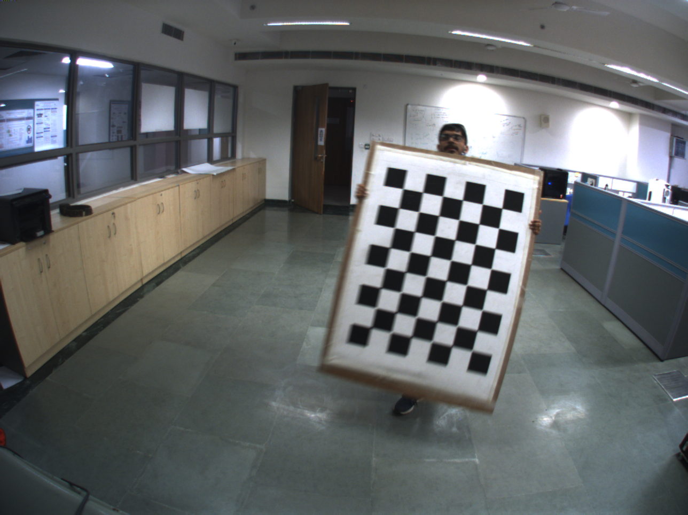
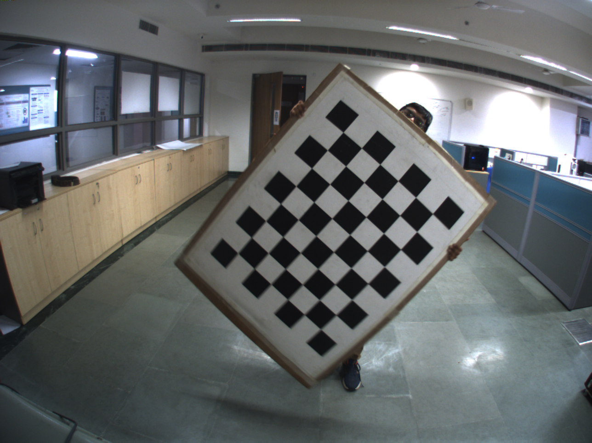
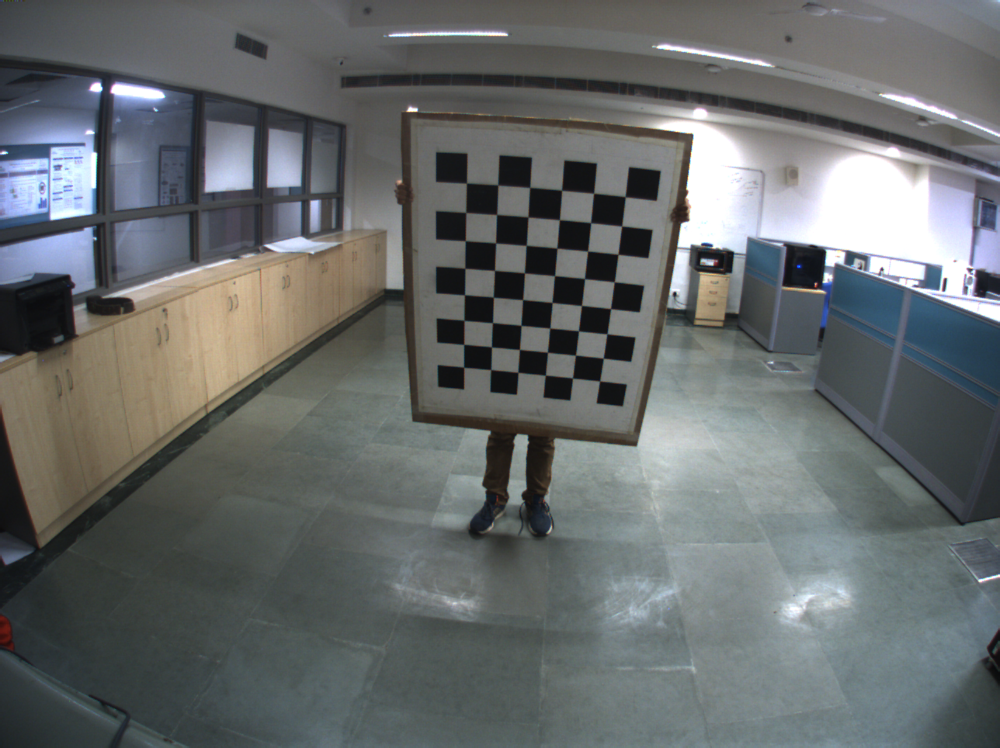
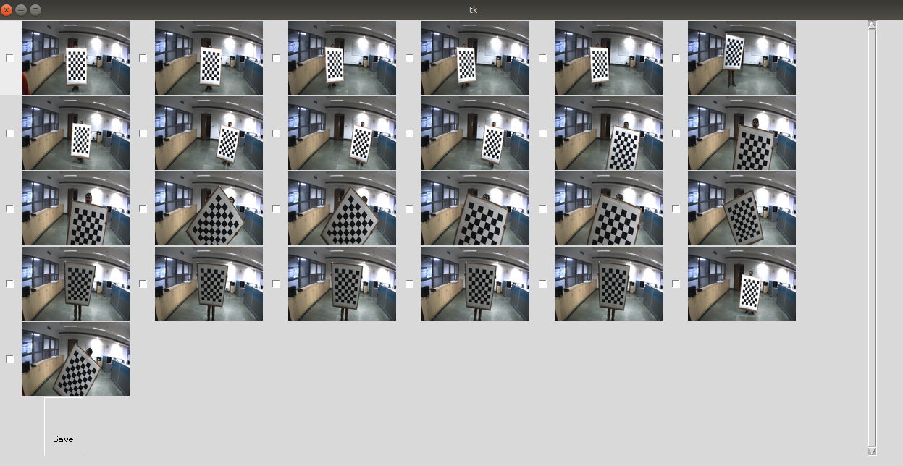

### Installing Camera, Lidar and code dependencies
* First you need to check if ROS PATH is set in .bashrc. If not, write 
source /opt/ros/melodic/setup.bash in .bashrc and source it.  
You can check the path with the command : roscd it should change the directory to /opt/ros/melodic.
* Open a terminal window.  
    `sudo apt-get install ros-melodic-pointgrey-camera-driver`  

* From the given link : [Velodyne sensor](http://wiki.ros.org/velodyne/Tutorials/Getting%20Started%20with%20the%20Velodyne%20VLP16),
   follow the given steps in the Velodyne documentation. **Do not follow step 1.2.  
   Also, make sure you have the internet 
   on for installation processes and ethernet on for velodyne to work.**
* Check the version of pip, and upgrade it if necessary using command:
    * `python3 -m pip install --upgrade pip`

* Go to the calibration directory using “cd” command. Run the following:

    * For installation of tkinter:  
        `sudo apt-get install python3-tk`  
    * For installation of pypcd on python2:  
        `pip install pypcd`  
    * Installation of rest of the requirements on python3:  
        `cat requirements.txt | xargs -n 1 pip3 install`

### Understanding calib_config.yaml
* Go to the folder where all the code exists, and open defaults.py
* It is a configuration file which can be used to change the values based on how you want the calibration to be done.
* Parameters of calib_config.yaml include:
    
    * **ROS Topics**: It is a dictionary with keys as “camera_topics” and “lidar_topics” and the values are the respective topics given by point grey camera and velodyne sensor.   
    
    * **Image Select Column**: Number of columns that should pop up at the screen while running image_select_gui script.  
    
    * **Azimuth Angle in degrees**: It is the angle in front of the sensors. It is the range in which you want to move the calibration board.  
    
    * **Depth Threshold in metres**: It is the range of depth in which you want to move the calibration board in front of the sensors.   
    
    * **Residual Threshold RANSAC**: Distance of the points in metres to be an inlier for the Plane estimation.  
    
    * **Minimum Points RANSAC**: minimum number of lidar points to estimate a plane and then figure out how many points in total pass through the plane.   

    * **Number of samples Train**: Number of samples you want to select for calculation of rotation and translation vectors.   
    
    * **Camera FPS**: Frames per second of the camera used.  
    
    * **Lidar Frequency**: Number of Lidar scans per second of the LIDAR used.  
    
    * **Square Length in metres**: Length of the dimension of the square on the calibration board.   
      
    * **Plot Camera Lidar Normals**:[True, False] Plot the graph for camera normals, lidar normals, and transformed normals.    

    * **Plot Camera Lidar Plots**: [True, False] Show the plots for the transformation of one coordinate frame to another.  
    
    * **Duration in seconds**: Duration for which bag file has to be recorded.
    
### Launching and determining the ROS Topics
Open 2 terminals

* On first terminal, write the command:  
   `roslaunch pointgrey_camera_driver camera.launch`

* On 2nd terminal, write the command:  
    `roslaunch velodyne_pointcloud VLP16_points.launch`
    
### Running the calibration pipeline:
Once the Sensors starts publishing the data, open 3rd terminal to start recording the bag file and run the calibration pipeline. 

* Go to the folder where you have all the calibration code is saved.

* Write the command:  
`python3 pipeline_calibration.py --bag_file <bag file name> --output_dir <output directory>`  
For example:  
`python3 pipeline_calibration.py --bag_file data.bag --output_dir /home/dheerajk/calbration_results/`  

* Start moving in front of the camera with the calibration board. Keep yourself still at each position for a couple of seconds in order to avoid blurriness in the dataset collection.

* Move the calibration board with different angles and distances in front of the camera. _**A person can supervise your movements on rviz.**_

* After few seconds, a GUI will prompt up from where you need to select the most diverse images in terms of distances and angles.  

* The number of images will be equal to the duration you have selected to record the bag file. A scroll bar is given with which you can go down. After selecting the required images, you have to press “Save” at the bottom of all the images.

* While the complete pipeline is running, you can visualize the graphs between **“camera normals”**, **“lidar normals”**, and **“transformed normals”**. For this, you need to set `plot_cam_lidar_normals = true` in **calib_config.yaml**

   

